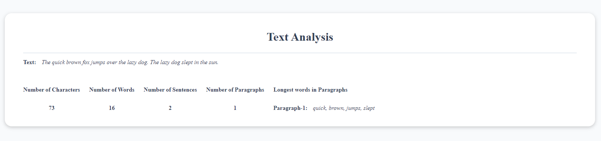

# Text-Analyzer

An application that reads contents from a text file and calculates some parameters. It will calculate the count of words, characters, paragraphs, and more.

## Features

-   Calculate the number of words, characters, sentences, and paragraphs in a given text file.
-   Retrieve the longest words in each paragraph.
-   Expose APIs for easy integration into other applications.

## Technology Used

-   Node.js
-   Express.js
-   Natural
-   HTML
-   CSS

## Instructions

### 1. Setup

-   Clone the repository to your local machine.

```sh
git clone https://github.com/ajewelbd/text-analyzer
```

-   Run `npm install` command to install dependencies.

### 2. Running the Application:

-   Execute `npm run dev` in the terminal.
-   The server will run on http://localhost:5000 by default.
-   In the home page `http://localhost:5000` an User Interface will be displayed with analyzed information.
    

### 3. Using the APIs:

Use the following API endpoints:

-   `GET /character-count`: Get the number of characters in the text.<br/>
    **Sample Response**

```js
{
  "characters": 73
}
```

-   `GET /word-count`: Get the number of words in the text.<br/>
    **Sample Response**

```js
{
  "words": 16
}
```

-   `GET /sentence-count`: Get the number of sentences in the text.<br/>
    **Sample Response**

```js
{
  "sentences": 2
}
```

-   `GET /paragraph-count`: Get the number of paragraphs in the text.<br/>
    **Sample Response**

```js
{
  "paragraphs": 1
}
```

-   `GET /longest-words-in-pragraphs`: Get the longest words in each paragraph.<br/>
    **Sample Response**

```js
{
    "longestWords": [
        [
            "quick",
            "brown",
            "jumps",
            "slept"
        ]
        [
            "quick",
            "brown",
            "jumps",
            "slept"
        ]
    ]
}
// array of arrays. Index indicates the paragraph number in ascending order.
```

-   `GET /analysing-text`: Get the analyzing text.<br/>
    **Sample Response**

```js
{
    "text": "The quick brown fox jumps over the lazy dog. The lazy dog slept in the sun."
}
```

### 4. Sample Usage:

-   Make GET requests to the above endpoints using tools like `cURL`, `Postman`, `Thunder Client` or integrate the endpoints into your application.

## License

-   This project is licensed under the [MIT License](https://github.com/ajewelbd/text-analyzer/blob/main/LICENSE).
